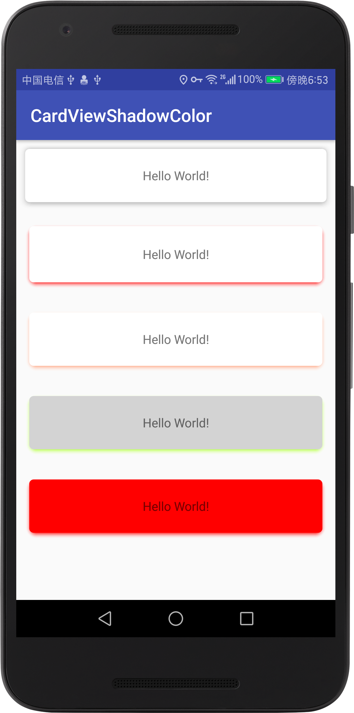

# CardViewShadowColor
CardView 支持修改阴影颜色

## 基于CardView version 24.2.1 改写



- 为了更方便的使用支持改变阴影颜色的CardView，基于CardView 24.2.1版本改写了支持改变阴影颜色的库, 为了和官方的CardView库共存，且不冲突，把所有属性、color及style的命名都加了前缀yc，当然也可以单独使用，使用方式如下

builb.gradle
```
最好和官方的CardView库一起使用，不需要特殊修改阴影颜色的地方，使用官方的CardView，
需要修改View阴影的地方才使用YcCardView
implementation 'com.zyp.cardview:cardview:1.0.1'（暂时不可用，因为今天(2018/9/22)才Add to JCenter，应该明天会审核通过）
```

pom.xml
```
<dependency>
  <groupId>com.zyp.cardview</groupId>
  <artifactId>cardview</artifactId>
  <version>1.0.1</version>
  <type>pom</type>
</dependency>

```

```
    <!--android:foreground="@drawable/item_selector"  api>=21 ripper  api<21 selector-->
    <!--android:stateListAnimator="@drawable/state_list_animator" 点击动画效果 支持api>=21-->
    <!--CardView 默认使用-->
    <android.support.v7.widget.CardView
        android:layout_width="match_parent"
        android:layout_height="wrap_content"
        android:layout_margin="10dp"
        android:clickable="true"
        android:focusable="true"
        android:foreground="@drawable/item_selector"
        android:stateListAnimator="@drawable/state_list_animator"
        app:cardBackgroundColor="@color/white"
        app:cardCornerRadius="5dp"
        app:cardElevation="5dp"
        app:cardMaxElevation="5dp"
        app:cardPreventCornerOverlap="false">

        <TextView
            android:layout_width="match_parent"
            android:layout_height="60dp"
            android:background="@null"
            android:gravity="center"
            android:text="Hello World!" />
    </android.support.v7.widget.CardView>
    <!--YcCardView的使用-->
    <!--ripper的范围无法控制-->
    <com.zyp.cardview.YcCardView
        android:layout_width="match_parent"
        android:layout_height="wrap_content"
        android:layout_margin="10dp"
        android:clickable="true"
        android:focusable="true"
        android:foreground="@drawable/item_selector"
        android:stateListAnimator="@drawable/state_list_animator"
        app:ycCardCornerRadius="5dp"
        app:ycCardElevation="5dp"
        app:ycCardMaxElevation="5dp"
        app:ycCardPreventCornerOverlap="true"
        app:ycStartShadowColor="@color/red">
        <!--只用设置开始颜色ycStartShadowColor，ycStartShadowColor默认值为#00ffffff 一般不用设置-->

        <TextView
            android:layout_width="match_parent"
            android:layout_height="60dp"
            android:gravity="center"
            android:text="Hello World!" />
    </com.zyp.cardview.YcCardView>

```